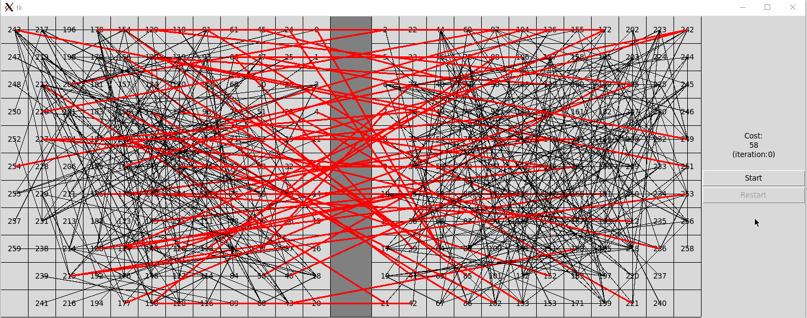
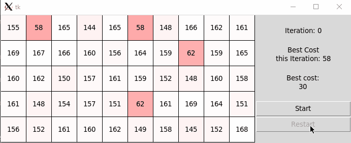
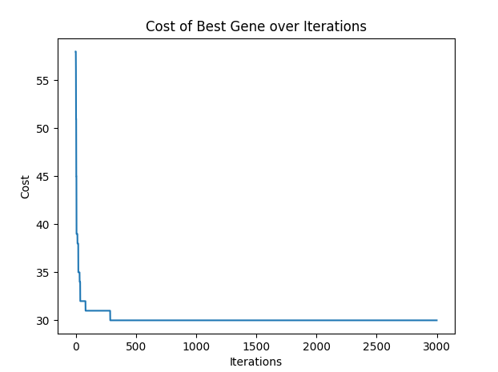
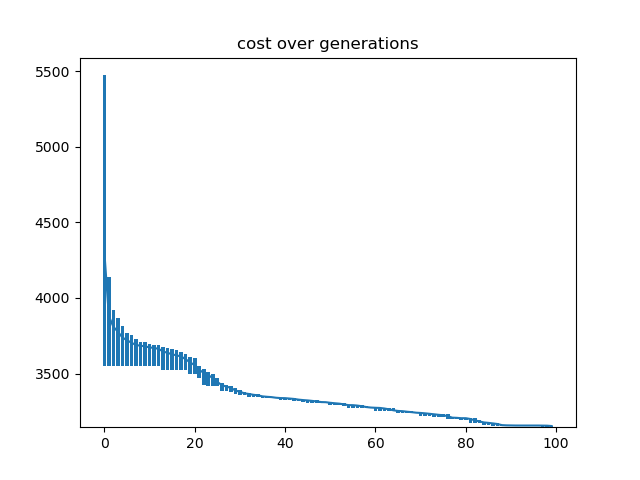

# Genetic Algorithms for CAD

## Partitioning
To run:

```
python3 main_partition.py --b <path to benchmark> --net <hyper or clique>
```

Set `--net` to `hyper` to represent nets as hyper-edges, or to `clique` to represent nets as cliques.

Add `--gui` to enable GUI rendering at the end.

Add `--no-local` to disable the local improvement stage.

### GUI
If GUI is enabled, the following will be rendered after the algorithm has terminated:

#### Partition Animation


This animation visually demonstrates how the best solution changes across iterations. Only iterations where a new best chromosome is produced is rendered.

#### Chromosome Heat Map
Once the partition animation is closed, a heat map animation is rendered:


Each cell of the heat map represents a chromosome in the population, and the color intensity represents how close the chromosome's cost is to the final best solution.

#### Cost Plot
Once the heat map animation is closed, a cost over iteration plot is rendered:


## Placement
To run:

```
python3 main_placement.py
```
All the parameters and benchmarks can be set in main_placement.py
### Cost Plot
The cost plot can be dynamically displayed if plot_enable=True, otherwise a final cost plot is saved.
